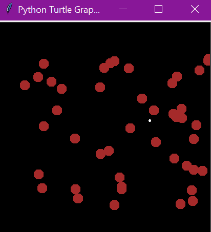

# Cannon Game
 Repository for a retro Cannon game, programmed with Python.
 
## Table of Contents
* [General info](#general-info)
* [Technologies](#technologies)
* [Setup](#setup)
* [Status](#status)
* [Inspiration](#inspiration)

## General info
This is repository contains a classic Cannon with balloons game. Tap on your screen to throw the ball and burst 
all the balloons you can! It must look like this when your run the code:



## Technologies
* Python 3.7.7
* Freegames 2.3.2
* Turtle and random were included with Python.

## Setup
To properly run (and play) this game, you'll need to import some Python packages: freegames, random and turtle.
As seen on this part of the code:

```Python
from random import randrange
from turtle import *
from freegames import vector
```

## Status
This code is already finished.

## Inspiration
This proyect is inspired by the Cannon game code at [Grant Jenks](http://www.grantjenks.com/docs/freegames/cannon.html) website.

## Collaborators
* [Edgar Castillo](https://github.com/EdgarCastilloRm)
* [Luis Martínez](https://github.com/A01570852)

